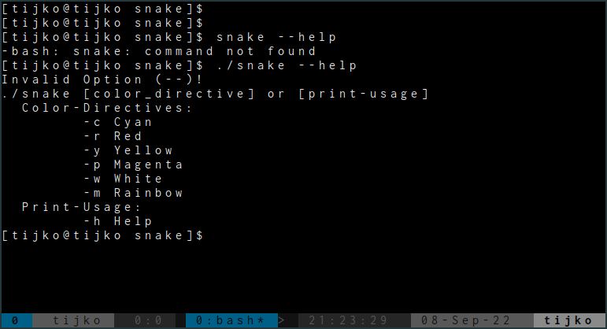
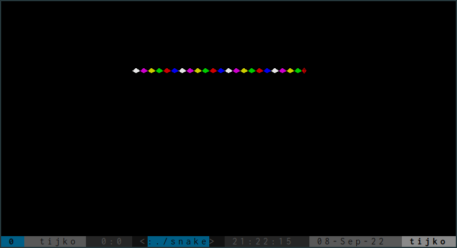
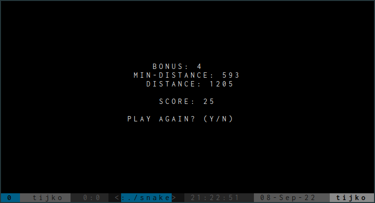

# snake

Classic snake game written in C with ncurses.

Got a hankering to create the old classic.  Very basic implementation at this 
point.

See how much pi you can get the snake to eat ;)

## Game Options
There are several options to change up the color of the game board.
By running with the command-line `help` argument you will get the
various color-options.

## Display
Here is a sample of the snake in rainbow mode!

`./snake -m`

and game-over :(

